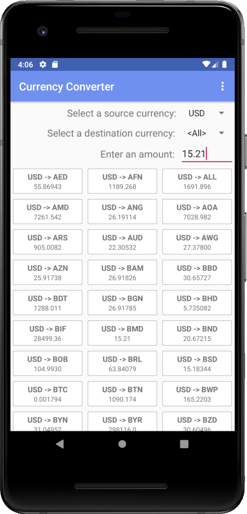

# Currency Converter #

This app shows you what a monetary amount converts to from one currency to another using the Currency Layer API.



## Overview ##

The project is designed with several paradigms:
* Modularization of components using Dagger to support app scalability
* MVVM: Strict separation of view, model and viewmodel data
* Reactive paradigms to minimize complexity and duplication
* View lifecycle aware data for performance (if the app had more activities/fragments)
* Discrete model repositories backed with Room Persistance Library for offline usage
* Material UI Design to look stylish

## Usage ##

Select a source currency, destination currency, and input the currency amount. The list below will populate with the conversion rate between those currencies. In the action bar menu, you may clear the database at any time. Additionally, you may swipe down to refresh the data if it has grown stale.

## Internal Components (Dagger) ##

Here is a high level overview of the project. It is organized and structured around the module components.

```
Dagger Component & Module Hierarchy
    
AppComponent
       │
       ├───AppModule
       │    └──AppContext─>──┐
       └───NetworkModule     │
            └──Retrofit─>────┤
                             │
      ┌──────<────────<──────┘
      │    
CurrencyComponent
      │
      ├──CurrencyAPIModule
      │   └──CurrencyAPIClient─>──────┐
      │                               │
      └──CurrencyDataModule           │
             ├──CurrencyRepository─>──┤
             └──QuoteRepository─>─────┤
                                      │
                                (Injects Into)
                                      ↓
                                CurrencyActivity
                                  └──CurrencyViewModel
                                       
```

App Component - Contains all the modules core to the app
* App Module - Provides app context
* Network Module - Provides API agnostic Retrofit client  

Currency Component - Contains all the modules required for Currency Conversion
* Currency API Module - Uses Network Module to provide a baked API for the currency API
* Currency Data Module - Uses App Module to provide both repositories

Thus, CurrencyActivity has all its required dependencies for its viewmodel 

## Data & Flow ##

All the logic for data loading, currency conversion, and managing in-memory data happens in CurrencyViewModel. The viewmodel observes the repositories and transforms the raw data into processed data for the view to easily consume. 

This is the data flow for how quotes are loaded. This does not include loading the currency list.
1) App starts or user swipes down to refresh
2) Viewmodel fetches data from the API if data is stale
3) Retrofit kicks off network request
4) Network call finishes, response mapped to POJO
5) Viewmodel checks response object
  a) If there is an error, an appropriate error event is posted
  b) If no error was found, the data is passed to the repository
6) Repository maps response to database entity & saves it
7) Viewmodel is observing repository, when new data set is loaded it builds an adjusted list according to the set currencies/amount
8) Activity is observing Viewmodel, when new data set is loaded it sets it in the adapter
9) Adapter builds item views for the recyclcerview and displays on screen
